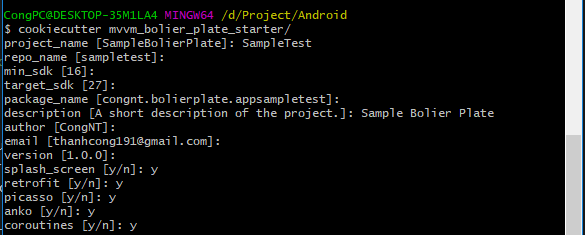

# Android Kotlin MVVM Starter

[](http://developer.android.com/index.html)


Android Kotlin Starter is a starter project which implements MVVM Pattern.  


## Libraries
It includes libraries
- [RxJava2](https://github.com/ReactiveX/RxJava) and [RxAndroid](https://github.com/ReactiveX/RxAndroid) and [RxKotlin](https://github.com/ReactiveX/RxKotlin) 
- [Retrofit](http://square.github.io/retrofit/) / [OkHttp](http://square.github.io/okhttp/)
- [Gson](https://github.com/google/gson)
- [Dagger 2](http://google.github.io/dagger/)
- [Timber](https://github.com/JakeWharton/timber)
- [Crashlytics](https://try.crashlytics.com/)
- [Picasso](http://square.github.io/picasso/)
- [Anko](https://github.com/Kotlin/anko)
- [Coroutines](https://github.com/Kotlin/kotlinx.coroutines)
- [Android Jetpack Architecture Components](https://developer.android.com/jetpack/arch/)
- [Espresso](https://google.github.io/android-testing-support-library/) for UI tests

**You can choose which library you want to include in your project**



#### Requirements

[python](https://www.python.org/)  
[pip](https://pypi.python.org/pypi/pip)  
[cookiecutter](https://github.com/audreyr/cookiecutter)  

#### Install
```
1. Install python
2. Install pip
3. pip install cookiecutter
```

Scaffold your project:
```
cookiecutter https://github.com/cong91/Kotlin_Android_MVVM_BolierPlate.git
```


##### Project Tree After Scaffold
```bash
.
├── LICENSE
├── README.md
├── art
│   └── example.png
├── cookiecutter.json
├── hooks
│   └── post_gen_project.py
├── requirements.txt
└── {{cookiecutter.repo_name}}
    ├── app
    │   ├── build.gradle
    │   ├── proguard-rules.pro
    │   └── src
    │       ├── androidTest
    │       │   └── java
    │       │       └── ApplicationTest.kt
    │       ├── main
    │       │   ├── AndroidManifest.xml
    │       │   ├── java
    │       │   │   ├── App.kt
    │       │   │   ├── core
    │       │   │   │   ├── BaseActivity.kt
    │       │   │   │   ├── BaseAdapter.kt
    │       │   │   │   ├── BaseDiffCallback.kt
    │       │   │   │   ├── BaseEntity.kt
    │       │   │   │   ├── BaseFragment.kt
    │       │   │   │   ├── BasePagedListAdapter.kt
    │       │   │   │   ├── BaseViewHolder.kt
    │       │   │   │   ├── BaseViewModel.kt
    │       │   │   │   ├── Dummy.kt
    │       │   │   │   ├── ViewModelFactory.kt
    │       │   │   │   └── recyclerview
    │       │   │   │       ├── BaseViewAdapter.kt
    │       │   │   │       ├── BindingViewHolder.kt
    │       │   │   │       ├── MultiTypeAdapter.kt
    │       │   │   │       └── SingleTypeAdapter.kt
    │       │   │   ├── db
    │       │   │   │   ├── AppDatabase.kt
    │       │   │   │   ├── dao
    │       │   │   │   │   ├── ExampleDao.kt
    │       │   │   │   │   └── PostDao.kt
    │       │   │   │   └── entities
    │       │   │   │       ├── Example.kt
    │       │   │   │       └── Post.kt
    │       │   │   ├── di
    │       │   │   │   ├── component
    │       │   │   │   │   └── ApplicationComponent.kt
    │       │   │   │   ├── module
    │       │   │   │   │   ├── ApplicationModule.kt
    │       │   │   │   │   ├── DatabaseModule.kt
    │       │   │   │   │   ├── NetModule.kt
    │       │   │   │   │   ├── ViewModelKey.kt
    │       │   │   │   │   └── ViewModelModule.kt
    │       │   │   │   └── scope
    │       │   │   │       └── ActivityScope.kt
    │       │   │   ├── network
    │       │   │   │   └── PostApi.kt
    │       │   │   ├── ui
    │       │   │   │   ├── list
    │       │   │   │   │   ├── PostListActivity.kt
    │       │   │   │   │   └── PostListViewModel.kt
    │       │   │   │   ├── login
    │       │   │   │   │   ├── LoginActivity.kt
    │       │   │   │   │   ├── LoginViewModel.kt
    │       │   │   │   │   ├── RegisterActivity.kt
    │       │   │   │   │   └── RegisterViewModel.kt
    │       │   │   │   ├── main
    │       │   │   │   │   ├── MainActivity.kt
    │       │   │   │   │   └── MainActivityViewModel.kt
    │       │   │   │   └── splash
    │       │   │   │       └── SplashActivity.kt
    │       │   │   └── utils
    │       │   │       ├── BindingAdapters.kt
    │       │   │       ├── extensions
    │       │   │       │   ├── ActivityExt.kt
    │       │   │       │   ├── AnyExt.kt
    │       │   │       │   ├── ContextExt.kt
    │       │   │       │   ├── FragmentExt.kt
    │       │   │       │   └── ViewExt.kt
    │       │   │       ├── service
    │       │   │       │   └── CallbackWrapper.kt
    │       │   │       └── timber
    │       │   │           └── CrashReportTree.kt
    │       │   └── res
    │       │       ├── drawable
    │       │       │   ├── android_starter.png
    │       │       │   ├── bg_input_cursor.xml
    │       │       │   ├── bg_input_cursor_2.xml
    │       │       │   ├── bt_shape.xml
    │       │       │   ├── bt_shape_2.xml
    │       │       │   ├── selector_bg_edit.xml
    │       │       │   ├── selector_bg_edit_2.xml
    │       │       │   ├── splash_logo.xml
    │       │       │   └── state_list_animator_z.xml
    │       │       ├── drawable-xxxhdpi
    │       │       │   ├── plus.png
    │       │       │   └── plus_x.png
    │       │       ├── layout
    │       │       │   ├── activity_login.xml
    │       │       │   ├── activity_main.xml
    │       │       │   ├── activity_post_list.xml
    │       │       │   ├── activity_register.xml
    │       │       │   ├── item_post.xml
    │       │       │   └── simple_place_holder.xml
    │       │       ├── mipmap-hdpi
    │       │       │   ├── ic_launcher.png
    │       │       │   └── ic_launcher_round.png
    │       │       ├── mipmap-mdpi
    │       │       │   ├── ic_launcher.png
    │       │       │   └── ic_launcher_round.png
    │       │       ├── mipmap-xhdpi
    │       │       │   ├── ic_launcher.png
    │       │       │   └── ic_launcher_round.png
    │       │       ├── mipmap-xxhdpi
    │       │       │   ├── ic_launcher.png
    │       │       │   └── ic_launcher_round.png
    │       │       ├── mipmap-xxxhdpi
    │       │       │   ├── ic_launcher.png
    │       │       │   └── ic_launcher_round.png
    │       │       ├── transition
    │       │       │   └── fabtransition.xml
    │       │       ├── values
    │       │       │   ├── colors.xml
    │       │       │   ├── dimens.xml
    │       │       │   ├── strings.xml
    │       │       │   └── styles.xml
    │       │       ├── values-v21
    │       │       │   └── styles.xml
    │       │       └── values-w820dp
    │       │           └── dimens.xml
    │       └── test
    │           └── java
    │               └── ExampleUnitTest.kt
    ├── build.gradle
    ├── gradle
    │   └── wrapper
    │       ├── gradle-wrapper.jar
    │       └── gradle-wrapper.properties
    ├── gradle.properties
    ├── gradlew
    ├── gradlew.bat
    └── settings.gradle

45 directories, 97 files
```

